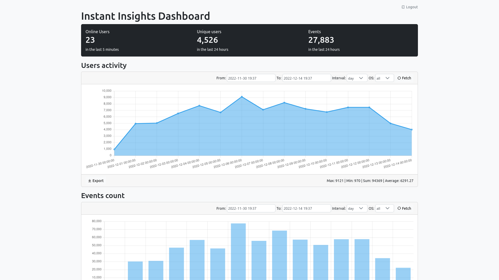

# instant-insights
Track events from different systems using ClickHouse. It includes a graphical user interface (GUI) that allows users to easily interact with the data and perform a variety of analyses.

To use the "instant-insights" project, you will need to have Node.js installed on your local machine. Alternatively, you can run the project using Docker.



### Run using Node.js
To run the project locally with Node.js, clone the repository and navigate to the project directory. Then, run the following command to install the required dependencies:
```shell
# Clone this repository:
git clone https://github.com/pilotpirxie/instant-insights.git

# Navigate to the project directory and install the required dependencies
cd instant-insights
yarn

# Start the app by running the following command
yarn run:ts
```

Once the server is running, you can access the GUI by opening a web browser and navigating to ``http://localhost:3000``.

### Run using Docker
To run the project using Docker, you will need to have Docker installed on your machine. Once Docker is installed, you can build the Docker image for the project by running the following command in the project directory:
```shell
# Change ClickHouse credentials to match your server
docker run -d -p 3000:3000 \
  --network=host \
  -e CLICKHOUSE_NAME='insights' \
  -e CLICKHOUSE_URL='http://localhost:8123' \
  -e CLICKHOUSE_USER='secretuser' \
  -e CLICKHOUSE_PASS='mysecretpassword' \
  pilotpirxie/instant-insights
```
This will start the Node.js server inside a Docker container, and you can access the GUI by opening a web browser and navigating to ``http://localhost:3000``.

### Environment variables
You can configure the project by setting the following environment variables:

```shell
# Name of the ClickHouse database
CLICKHOUSE_NAME=insights

# URL of the ClickHouse server
CLICKHOUSE_URL='http://localhost:8123'

# Username for the ClickHouse server
CLICKHOUSE_USER=secretuser

# Password for the ClickHouse server
CLICKHOUSE_PASS=mysecretpassword

# Maximum time to wait for a connection to the ClickHouse server
CLICKHOUSE_CONNECT_TIMEOUT=10000

# Maximum time to wait for a response from the ClickHouse server
CLICKHOUSE_REQUEST_TIMEOUT=30000

# Maximum number of open connections to the ClickHouse server
CLICKHOUSE_MAX_OPEN_CONNECTIONS=0

# When to insert batch data
CRON_INSERT_PATTERN='* * * * * *'

# Should events be discarded when errors occur
DISCARD_EVENTS_ON_INSERT_ERROR=true

# Maximum size of single event
MAX_EVENT_SIZE=1KB

# Maximum how long in seconds since last event is considered as online
ONLINE_TIMESPAN=5

# Token used for posting events
API_WRITE_TOKEN='1a2acdb9-b51e-4658-ab8e-c015a464362b'

# Enable/disable automatic backup of the database to S3
BACKUP_TO_S3_ENABLE=false

# S3 url containing the region, bucket and path
BACKUP_TO_S3_URL=''

# S3 access key
BACKUP_TO_S3_ACCESS_KEY=''

# S3 secret key
BACKUP_TO_S3_SECRET_KEY=''

# How often to backup the database to S3
BACKUP_TO_S3_CRON_PATTERN='0 0 */1 * *'

# Admin JWT secret
JWT_SECRET='secret'

# Admin JWT expiration time in seconds
TOKEN_EXPIRES_IN=86400

# Admin JWT refresh token expiration time in seconds
REFRESH_TOKEN_EXPIRES_IN=604800

# Default admin username
USER_EMAIL='admin@localhost'

# Default admin password
USER_PASSWORD='22486ec7-a3ec-4d9e-80d4-ecea8bc58bb2'
```

### Track events
To track events you can use the following API endpoint:
```shell
POST /api/events?token=API_WRITE_TOKEN

{
	"type": "view",
	"pathname": "product/41",
	"fingerprint": "anonymous-user-id",
	"meta": {
		"os": "ios",
		"osVersion": "16.0.2",
		"userId": "unique-user-id",
		"ipAddress": "127.0.0.1"
	},
	"params": {
	  "optional": "data"
	}
}
```

### High-level architecture


### Restore data from backup
```shell
# https://clickhouse.com/docs/en/manage/backups/#restore-from-the-incremental-backup
RESTORE TABLE insights.events FROM S3('https://BACKUP_S3_URL/BACKUP_DIRECTORY', 'BACKUP_S3_ACCESS_KEY', 'BACKUP_S3_SECRET_KEY');
```

### License
```shell
LGPL-2.1
```