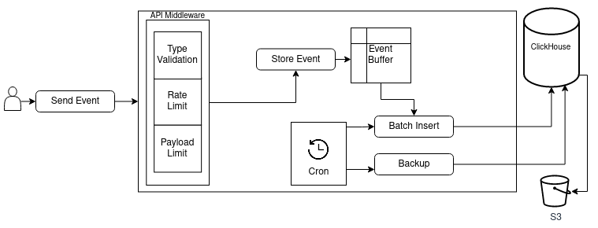

# instant-insights
Track events from different systems

### .env

```shell
CLICKHOUSE_NAME=insights
CLICKHOUSE_URL='http://localhost:8123'
CLICKHOUSE_USER=secretuser
CLICKHOUSE_PASS=mysecretpassword
CLICKHOUSE_CONNECT_TIMEOUT=10000
CLICKHOUSE_REQUEST_TIMEOUT=30000
CLICKHOUSE_MAX_OPEN_CONNECTIONS=0
CRON_INSERT_PATTERN='* * * * * *'
DISCARD_EVENTS_ON_INSERT_ERROR=true
MAX_EVENT_SIZE=1KB
ONLINE_TIMESPAN=5
API_WRITE_TOKEN='1a2acdb9-b51e-4658-ab8e-c015a464362b'
BACKUP_TO_S3_ENABLE=false
BACKUP_TO_S3_URL=''
BACKUP_TO_S3_ACCESS_KEY=''
BACKUP_TO_S3_SECRET_KEY=''
BACKUP_TO_S3_CRON_PATTERN='0 0 */1 * *'
JWT_SECRET='secret'
TOKEN_EXPIRES_IN='1d'
REFRESH_TOKEN_EXPIRES_IN='7d'
USER_EMAIL='admin@localhost'
USER_PASSWORD='22486ec7-a3ec-4d9e-80d4-ecea8bc58bb2'
```

### API

```shell
POST /api/events
GET /api/events
GET /api/events/pathnames
GET /api/events/types
GET /api/online
GET /api/stats
```

### High-level architecture


### Restore data from backup
```shell
# https://clickhouse.com/docs/en/manage/backups/#restore-from-the-incremental-backup
RESTORE TABLE insights.events FROM S3('https://BACKUP_S3_URL/BACKUP_DIRECTORY', 'BACKUP_S3_ACCESS_KEY', 'BACKUP_S3_SECRET_KEY');
```

### License
```shell
LGPL-2.1
```